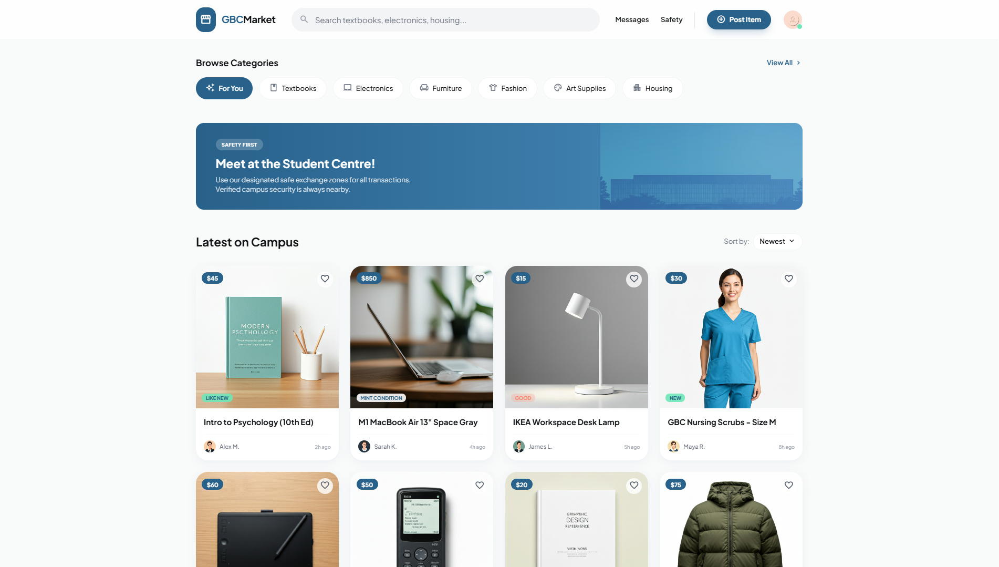
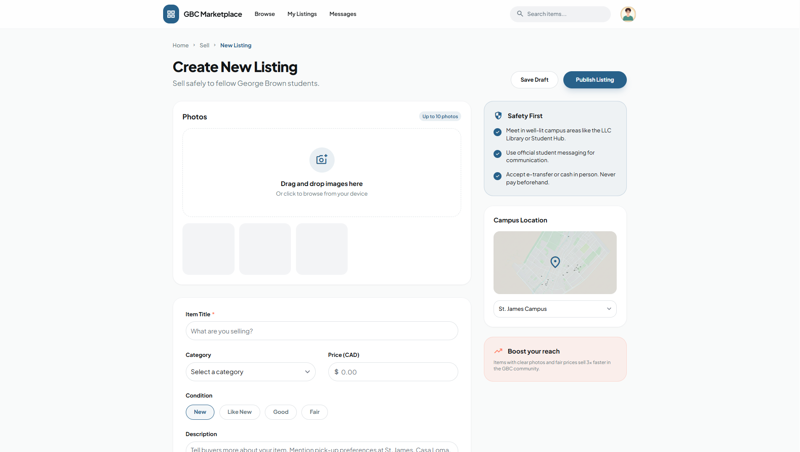

# GBC Market

A campus marketplace for George Brown College students to buy and sell items safely within the college community.

  
  
  
  
  
  

## Features

- Student-only marketplace with college email verification
- Real-time messaging between buyers and sellers
- Image uploads for listings
- Admin dashboard for content moderation
- Dark mode support
- Mobile-first responsive design

## Live Demo

[gbc-marketplace.vercel.app](https://gbc-marketplace.vercel.app/)

## Author

Built by [Arash Shalchian](https://github.com/A-Shalchian), 
[Diana Mohammadi](https://github.com/diana-mohammadi), 
and [Radin Madad Nezhad Aligorkeh](https://github.com/radinMadadNezhad).